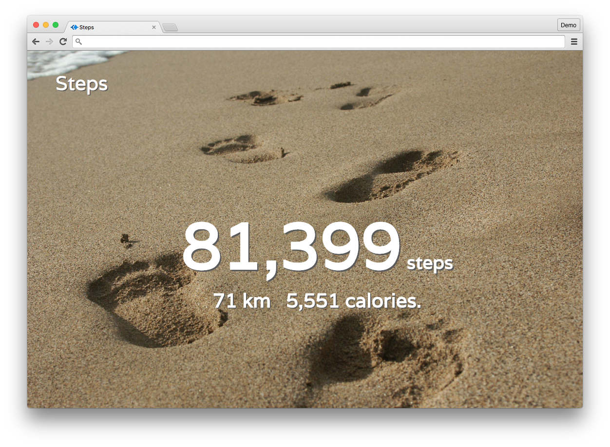

steps
=====

Total steps on Jawbone UP



## Usage

```
npm install
npm start
```

And direct your browser to `http://127.0.0.1:3000`.

## Contributing

Please send me pull requests or file an issue! <3

## License

MIT. See LICENSE.md file.
